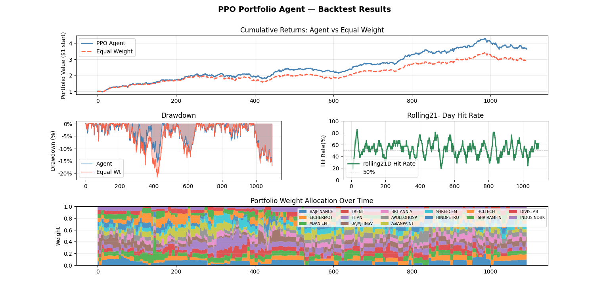

# PCA-PPO-Portfolio-Optimization-with-Momentum-Filter-
This project trains a PPO reinforcement learning agent to optimize portfolio weights using PCA-derived market factors as state features.   The agent is trained to outperform an equal-weight benchmark under transaction costs and trading constraints.


## Motivation
Classical portfolio methods are often static. This project explores a dynamic allocation approach where:
- State = rolling PCA factors from asset returns
- Policy = PPO agent outputs portfolio weights
- Overlay = momentum-based filter to suppress weak assets
- Objective = beat equal-weight benchmark net of costs

## Method Overview
1. Load price data and convert to returns.
2. Split train/test data.
3. Fit PCA on train returns and project both train/test into factor space.
4. Train PPO agent in custom environment:
   - Rebalancing frequency
   - Transaction cost penalty
   - Minimum holding period
   - Minimum weight-change threshold
5. Backtest on unseen test data vs equal-weight portfolio.

## Project Structure
- `run.py` - end-to-end training and backtest entrypoint
- `data.py` - loading and return construction
- `factors.py` - PCA feature extraction
- `environment.py` - RL environment and reward logic
- `agent.py` - PPO policy/critic and training loop
- `backtest.py` - performance metrics and plots
- `sample_data.csv` - sample dataset

## Training and Backtesting Notes
- Backtesting uses pooled multiprocessing and numpy vectorization to speed up computation.
- To keep runtime practical, this project does not use a naive daily walk-forward retrain.
- Instead, the full dataset is split into 10 chronological periods.
- Walk-forward validation is run in 5 folds:
  - Fold 1: train on periods 1-5, test on period 6
  - Fold 2: train on periods 1-6, test on period 7
  - Fold 3: train on periods 1-7, test on period 8
  - Fold 4: train on periods 1-8, test on period 9
  - Fold 5: train on periods 1-9, test on period 10

## Requirements 
```
numpy==2.3.3
scipy==1.16.2
pandas==2.3.2
matplotlib==3.10.6
```

## GitHub Installation
```bash
pip install "git+https://github.com/Chinmaec/RL-Portfolio-with-Momentum-Filter.git"
```

## Usage
```bash
cd RL-Portfolio-with-Momentum-Filter
pip install -r requirements.txt
python test.py
```

## Expected Output 
```bash
[INFO] Loading data from sample_data.csv
[INFO] Train period: 2015-01-01 to 2021-12-31 | Test period: 2022-01-01 to 2023-12-31
[INFO] PCA factors retained: 5 (explained variance: 82.4%)
[TRAIN] Episode 010 | Reward: 0.0124 | Turnover: 0.084 | Cost: 0.0011
[TRAIN] Episode 020 | Reward: 0.0189 | Turnover: 0.071 | Cost: 0.0009
...
[TEST] PPO CAGR: 14.2% | Sharpe: 1.18 | Max Drawdown: -11.6%
[TEST] EQW CAGR: 10.5% | Sharpe: 0.91 | Max Drawdown: -14.8%
```

<p align="center">
  
</p>


